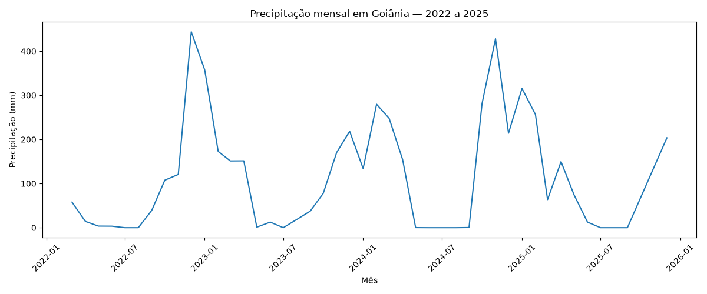

# Dados climáticos - Goiânia

## 1. Objetivo

Caracterizar as condições climáticas de Goiânia entre 2022 e 2025,
com foco em precipitação, temperatura e outras variáveis meteorológicas
que posteriormente poderão ser analisadas em conjunto com indicadores
de saúde.

## 2. Fontes

- Fonte: INMET
- Localidade: Goiânia/GO
- Período: 2022–2025
- Frequência: horária
- Formato original: CSV

## 3. Dados utilizados

O conjunto de dados contém registros horários das seguintes variáveis:

- temperatura instantânea
- temperatura máxima
- temperatura mínima
- umidade relativa
- pressão atmosférica
- velocidade do vento
- direção do vento
- rajada de vento
- radiação
- precipitação

## 4. Armazenamento

Os dados foram importados para:

- Banco: `vulnerabilidade_saude_goiania`
- Schema: `ambiental`
- Tabela: `clima`

Total de registros:

35.064

Período:

01/01/2022 a 31/12/2025

## 5. Qualidade e completude

Foi realizada uma análise da completude dos registros de precipitação
por mês.

A completude foi calculada pela razão entre o número de registros
não nulos de precipitação e o número total de registros esperados
no mês.

### Principais resultados

- 2022 apresentou ausência total de precipitação registrada em janeiro
  e fevereiro.
- Março de 2022 apresentou 74,60% de completude.
- Outubro de 2022 apresentou 88,31%.
- Novembro de 2022 apresentou 97,50%.
- Dezembro de 2022 apresentou 92,74%.
- A maior parte de 2023 apresentou 100% de completude.
- Setembro de 2024 apresentou 91,94%.
- 2025 apresentou redução significativa da completude a partir de maio.
- Setembro de 2025 apresentou apenas 7,22%.
- Outubro e novembro de 2025 não apresentaram registros de precipitação.

## 6. Análise exploratória

Foi calculada a precipitação mensal a partir da soma dos registros
horários de precipitação.

Observou-se um padrão sazonal, com maiores volumes de precipitação
concentrados principalmente nos meses do período chuvoso e menores
volumes durante o período seco.

Entretanto, os resultados de 2025 devem ser interpretados com cautela
devido à baixa completude dos dados em determinados meses.

### Gráfico

